# Rafael Manteiga Balbino

**Bacharelando em Ciência da Computação | Suporte Técnico & Análise de Dados | Python, SQL, Excel**

---

## 🧠 Sobre

🎓 Estudante de **Ciência da Computação** pela **UERJ**, com experiência prática em suporte técnico e análise de dados.  
💻 Foco em **Python** e **PostgreSQL**.

---

## 🛠️ Linguagens

---

## 📊 Linguagens mais usadas

  

---

## 🚀 Projetos em destaque

### 🦴 PaleoLab Científico
Laboratório virtual interativo para ensino de paleontologia, com dados científicos reais, jogos e modelos matemáticos.  
**Stack:** Python, Streamlit, Pandas, Matplotlib  
[🔗 Repositório](https://github.com/fael0306/dino)

### 🧩 Sudoku
Jogo de Sudoku com interface de linha de comando, geração de tabuleiros e verificação.  
**Stack:** Python  
[🔗 Repositório](https://github.com/fael0306/sudoku)

### ✖️⭕ Jogo da Velha
Clássico jogo da velha (tic-tac-toe) para dois jogadores, com verificação de vitória.  
**Stack:** Python  
[🔗 Repositório](https://github.com/fael0306/jogodavelha)

### 🃏 Blackjack
Simulação do jogo de cartas Blackjack contra o dealer, seguindo regras tradicionais.  
**Stack:** Python  
[🔗 Repositório](https://github.com/fael0306/blackjack)

### 🔒 Magnum Engenharia – Sistema de Gestão de Obras
Sistema web privado para controle financeiro e operacional de obras, desenvolvido sob demanda para a Magnum Engenharia.  
**Stack:** Python, Streamlit, PostgreSQL, Plotly, Pandas  
*(Repositório privado – acesso restrito à equipe)*

---

*Este README foi gerado pelo Deepseek.*
